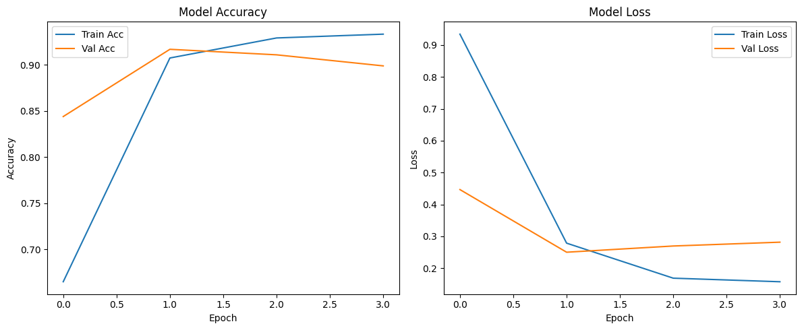

# FineTune-KerasLLM: Emotion Classification with Hugging Face & ALBERT

This project demonstrates how to fine-tune a pre-trained large language model (LLM) using **Keras** and **Hugging Face Transformers**. The model is trained for **emotion classification**, transforming raw English text into one of six emotional categories using the `albert-base-v2` architecture and TensorFlow.

---

## 🌐 Hosted Model

You can access and use the trained model directly on Hugging Face:

👉 **[saada2024/classiv1_albert_model](https://huggingface.co/saada2024/classiv1_albert_model)**

---

## 📁 Files Included

| File / Folder                | Description                                                   |
|-----------------------------|---------------------------------------------------------------|
| `code.py`                   | Main training pipeline — loading data, tokenizing, training, and visualizing results. |
| `epochs results.png`        | Training and validation curves for accuracy and loss.         |
| `classiv1_albert_model/`    | Saved fine-tuned model and tokenizer in Hugging Face-compatible format. |

---

## 🧠 Project Architecture

- **Base Model**: [ALBERT-base-v2](https://huggingface.co/albert-base-v2)
- **Dataset**: [dair-ai/emotion](https://huggingface.co/datasets/dair-ai/emotion)
- **Frameworks**: TensorFlow (Keras API) + Hugging Face Transformers + Datasets
- **Pipeline Overview**:
  1. Load and preprocess data (with tokenizer)
  2. Create `tf.data.Dataset` from generator
  3. Fine-tune LLM using `TFAutoModelForSequenceClassification`
  4. Apply early stopping and monitor metrics
  5. Visualize results

---

## 📊 Training Results

The figure below shows training/validation accuracy and loss:

- **Training Accuracy**: ~93%  
- **Validation Accuracy**: ~91%  
- **Observation**: Early stopping prevented overfitting and ensured generalization.

---

## ⚠️ Limitations

- Evaluation on the test set is not included.
- Model limited to 6 emotion classes and English only.
- No deployment layer yet (e.g., API, web interface).

---

## 🔧 Future Enhancements

- Run evaluation on test split (`ds_test`) and compute F1-score, confusion matrix.
- Integrate multi-label and multilingual support.
- Build Gradio or Streamlit interface for interactive demos.
- Package the model for ONNX or TFLite for mobile deployment.
- Try adapter-based fine-tuning (LoRA/PEFT) for low-resource environments.

---

`Documented by [M.A.Saada]`
